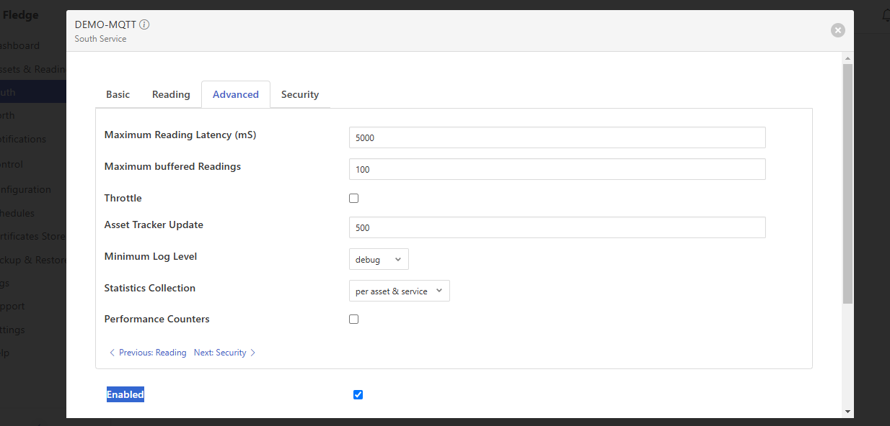

# comms_gateway

Bidirectional gateway for communications protocols used by power systems

|                              | FledgeIoT                                                                                                           | FledgePower                                                                                                         | EdgeXFoundry                                                                                                   | Thingsboard Community Edition                                                                                                                   | Node-RED                                                                                           |
| ---------------------------- | ------------------------------------------------------------------------------------------------------------------- | ------------------------------------------------------------------------------------------------------------------- | -------------------------------------------------------------------------------------------------------------- | ----------------------------------------------------------------------------------------------------------------------------------------------- | -------------------------------------------------------------------------------------------------- |
| Owner / Maintainer           | Linux Foundation (Edge)                                                                                             | Linux Foundation (Energy)                                                                                           | Linux Foundation (Edge)                                                                                        | ThingsBoard, Inc                                                                                                                                | OpenJS Foundation                                                                                  |
| Website                      | [https://lfedge.org/projects/fledge/](https://lfedge.org/projects/fledge/)                                          | [https://lfenergy.org/projects/fledgepower/](https://lfenergy.org/projects/fledgepower/)                            | [https://lfedge.org/projects/edgex-foundry/](https://lfedge.org/projects/edgex-foundry/)                       | [https://thingsboard.io/](https://thingsboard.io/)                                                                                              | [https://nodered.org/](https://nodered.org/)                                                       |
| Source Code                  | [https://github.com/fledge-iot/fledge](https://github.com/fledge-iot/fledge)                                        | [https://github.com/fledge-power/fledgepower-deployment](https://github.com/fledge-power/fledgepower-deployment)    | [https://github.com/edgexfoundry/edgex-go](https://github.com/edgexfoundry/edgex-go)                           | [https://github.com/thingsboard/thingsboard](https://github.com/thingsboard/thingsboard)                                                        | [https://github.com/node-red/node-red](https://github.com/node-red/node-red)                       |
| Documentation                | [https://fledge-iot.readthedocs.io/en/latest/](https://fledge-iot.readthedocs.io/en/latest/)                        | [https://wiki.lfenergy.org/display/FLED/FledgePower](https://wiki.lfenergy.org/display/FLED/FledgePower)            | [https://docs.edgexfoundry.org/3.1/](https://docs.edgexfoundry.org/3.1/)                                       | [https://thingsboard.io/docs/](https://thingsboard.io/docs/)                                                                                    | [https://nodered.org/docs/](https://nodered.org/docs/)                                             |
| Forks                        | 44                                                                                                                  | 3                                                                                                                   | 481                                                                                                            | 5k                                                                                                                                              | 3.4k                                                                                               |
| Stars                        | 120                                                                                                                 | 4                                                                                                                   | 1.3k                                                                                                           | 17k                                                                                                                                             | 19.3k                                                                                              |
| Commits                      | 11k                                                                                                                 | 0.5k                                                                                                                | 4.5k                                                                                                           | 19.5k                                                                                                                                           | 9.2k                                                                                               |
| License                      | Apache-2.0                                                                                                          | Apache-2.0                                                                                                          | Apache-2.0                                                                                                     | Apache-2.0                                                                                                                                      | Apache-2.0                                                                                         |
| Modbus TCP                   | [✓](https://fledge-iot.readthedocs.io/en/latest/plugins/fledge-south-mqtt-readings/index.html)                      | x                                                                                                                   | [✓](https://docs.edgexfoundry.org/3.1/microservices/device/services/device-modbus/ProtocolProperties/)         | [✓](https://thingsboard.io/docs/iot-gateway/config/modbus/)                                                                                     | [✓](https://flows.nodered.org/node/node-red-contrib-modbus)                                        |
| MQTT                         | [✓](https://fledge-iot.readthedocs.io/en/latest/plugins/fledge-south-mqtt-readings/index.html)                      | x                                                                                                                   | [✓](https://docs.edgexfoundry.org/3.1/microservices/device/services/device-mqtt/Configuration/)                | [✓](https://thingsboard.io/docs/reference/mqtt-api/)                                                                                            | [✓](https://cookbook.nodered.org/mqtt/connect-to-broker)                                           |
| HTTP                         | [✓](https://fledge-iot.readthedocs.io/en/latest/plugins/fledge-south-http_south/index.html)                         | x                                                                                                                   | [✓](https://docs.edgexfoundry.org/3.1/microservices/device/services/device-rest/GettingStarted/)               | [✓](https://thingsboard.io/docs/reference/http-api/)                                                                                            | [✓](https://cookbook.nodered.org/#http-endpoints)                                                  |
| IEC 104                      | ?                                                                                                                   | [✓](https://github.com/fledge-power/fledge-south-iec61850)                                                          | x                                                                                                              | x                                                                                                                                               | x                                                                                                  |
| DNP3                         | [✓](https://fledge-iot.readthedocs.io/en/latest/plugins/fledge-south-dnp3/index.html)                               | x                                                                                                                   | x                                                                                                              | x                                                                                                                                               | x                                                                                                  |
| OPC-UA                       | [✓](https://fledge-iot.readthedocs.io/en/latest/plugins/fledge-south-opcua/index.html)                              | x                                                                                                                   | [✓](https://github.com/edgexfoundry/device-opc-ua)                                                             | [✓](https://thingsboard.io/docs/iot-gateway/config/opc-ua/)                                                                                     | [✓](https://flows.nodered.org/node/node-red-contrib-opcua)                                         |
| IEC 61850 MMS                | x                                                                                                                   | [✓](https://github.com/fledge-power/fledge-south-iec61850)                                                          | x                                                                                                              | x                                                                                                                                               | x                                                                                                  |
| Simulated devices            | [✓](https://fledge-iot.readthedocs.io/en/latest/plugins/fledge-south-Random/index.html)                             | [✓](https://fledge-iot.readthedocs.io/en/latest/plugins/fledge-south-Random/index.html)                             | [✓](https://docs.edgexfoundry.org/3.1/microservices/device/services/device-virtual/Ch-VirtualDevice/)          | [✓](https://thingsboard.io/docs/user-guide/rule-engine-2-0/action-nodes/#generator-node)                                                        | [✓](https://flows.nodered.org/flow/760020a6b20660c066bed1dd547b51a1)                               |
| REST Admin API               | [✓](https://fledge-iot.readthedocs.io/en/latest/rest_api_guide/index.html)                                          | [✓](https://fledge-iot.readthedocs.io/en/latest/rest_api_guide/index.html)                                          | [✓](https://docs.edgexfoundry.org/3.1/api/Ch-APIIntroduction/)                                                 | [✓](https://thingsboard.io/docs/reference/rest-api/)                                                                                            | [✓](https://nodered.org/docs/api/)                                                                 |
| HTTP output                  | [✓](https://fledge-iot.readthedocs.io/en/latest/plugins/fledge-north-http_north/index.html)                         | [✓](https://fledge-iot.readthedocs.io/en/latest/plugins/fledge-north-http_north/index.html)                         | [✓](https://docs.edgexfoundry.org/3.1/microservices/application/sdk/api/BuiltInPipelineFunctions/#http-export) | [✓](https://thingsboard.io/docs/user-guide/rule-engine-2-0/external-nodes/#rest-api-call-node)                                                  | [✓](https://cookbook.nodered.org/#http-requests)                                                   |
| Streaming output             | [✓](https://fledge-iot.readthedocs.io/en/latest/plugins/fledge-north-Kafka/index.html)                              | [✓](https://fledge-iot.readthedocs.io/en/latest/plugins/fledge-north-Kafka/index.html)                              | [✓](https://docs.edgexfoundry.org/3.1/microservices/application/sdk/api/BuiltInPipelineFunctions/#mqtt-export) | [✓](https://thingsboard.io/docs/user-guide/rule-engine-2-0/external-nodes/#mqtt-node)                                                           | [✓](https://cookbook.nodered.org/mqtt/publish-to-topic)                                            |
| Dashboard                    | [✓](https://fledge-iot.readthedocs.io/en/latest/quick_start/gui.html)                                               | ?                                                                                                                   | [✓](https://docs.edgexfoundry.org/3.1/getting-started/tools/Ch-GUI/)                                           | [✓](https://thingsboard.io/docs/user-guide/rule-engine-2-0/re-getting-started/)                                                                 | [✓](https://nodered.org/docs/developing-flows/)                                                    |
| Real time latest measurement | [✓](https://fledge-iot.readthedocs.io/en/latest/rest_api_guide/04_RESTuser.html#get-asset-reading)                  | [✓](https://fledge-iot.readthedocs.io/en/latest/rest_api_guide/04_RESTuser.html#get-asset-reading)                  | [✓](https://docs.edgexfoundry.org/3.1/microservices/core/data/ApiReference/)                                   | [✓](https://demo.thingsboard.io/swagger-ui/index.html#/telemetry-controller/getLatestTimeseries)                                                | [✓](https://cookbook.nodered.org/http/serve-json-content)                                          |
| Min / Max / Avg measurement  | [✓](https://fledge-iot.readthedocs.io/en/latest/rest_api_guide/04_RESTuser.html#get-asset-reading-summary)          | [✓](https://fledge-iot.readthedocs.io/en/latest/rest_api_guide/04_RESTuser.html#get-asset-reading-summary)          | ?                                                                                                              | [✓](https://demo.thingsboard.io/swagger-ui/index.html#/telemetry-controller/getTimeseries)                                                      | [✓](https://flows.nodered.org/node/node-red-contrib-calc)                                          |
| Expressions                  | [✓](https://fledge-iot.readthedocs.io/en/latest/plugins/fledge-filter-expression/index.html)                        | [✓](https://fledge-iot.readthedocs.io/en/latest/plugins/fledge-filter-expression/index.html)                        | ?                                                                                                              | [✓](https://thingsboard.io/docs/user-guide/rule-engine-2-0/action-nodes/#math-function-node)                                                    | [✓](https://flows.nodered.org/flow/29fd01f8a62fec86d875ecbd68001cb0)                               |
| Alarms / Notifications       | [✓](https://fledge-iot.readthedocs.io/en/latest/services/fledge-service-notification/index.html)                    | [✓](https://fledge-iot.readthedocs.io/en/latest/services/fledge-service-notification/index.html)                    | [✓](https://docs.edgexfoundry.org/3.1/microservices/support/eKuiper/Ch-eKuiper/)                               | [✓](https://thingsboard.io/docs/user-guide/alarms/)                                                                                             | [✓](https://flows.nodered.org/node/node-red-contrib-nools)                                         |
| Scheduler                    | [✓](https://fledge-iot.readthedocs.io/en/latest/building_fledge/05_tasks.html)                                      | [✓](https://fledge-iot.readthedocs.io/en/latest/building_fledge/05_tasks.html)                                      | [✓](https://docs.edgexfoundry.org/3.1/microservices/support/scheduler/Purpose/)                                | x                                                                                                                                               | [✓](https://flows.nodered.org/node/node-red-contrib-cron-plus/in/c8156f6276976bfb518d1e60442e01e2) |
| Uplink Commands              | [✓](https://fledge-iot.readthedocs.io/en/latest/control.html#operation)                                             | [✓](https://fledge-iot.readthedocs.io/en/latest/control.html#operation)                                             | [✓](https://docs.edgexfoundry.org/3.1/microservices/core/command/Purpose/)                                     | [✓](https://thingsboard.io/docs/user-guide/rpc/)                                                                                                | ✓                                                                                                  |
| Docker / Docker Compose      | [✓](https://github.com/RobRaesemann/FLEDGE-IOT-Docker)                                                              | [✓](https://github.com/fledge-power/fledgepower-deployment)                                                         | [✓](https://docs.edgexfoundry.org/3.1/getting-started/Ch-GettingStartedDockerUsers/)                           | [✓](https://thingsboard.io/docs/user-guide/install/cluster/docker-compose-setup/)                                                               | [✓](https://nodered.org/docs/getting-started/docker)                                               |
| Scalability                  | ?                                                                                                                   | ?                                                                                                                   | ?                                                                                                              | [✓](https://thingsboard.io/docs/reference/iot-platform-deployment-scenarios/#cluster-deployment-with-the-microservices-architecture-scenario-c) | x                                                                                                  |
| High Availability            | ?                                                                                                                   | ?                                                                                                                   | ?                                                                                                              | [✓](https://thingsboard.io/docs/reference/iot-platform-deployment-scenarios/#cluster-deployment-with-the-microservices-architecture-scenario-c) | x                                                                                                  |
| Python SDK                   | [✓](https://fledge-iot.readthedocs.io/en/latest/plugin_developers_guide/02_writing_plugins.html#plugin-information) | [✓](https://fledge-iot.readthedocs.io/en/latest/plugin_developers_guide/02_writing_plugins.html#plugin-information) | x                                                                                                              | [✓](https://thingsboard.io/docs/iot-gateway/custom/)                                                                                            | x                                                                                                  |
| C SDK                        | [✓](https://fledge-iot.readthedocs.io/en/latest/plugin_developers_guide/03_south_C_plugins.html)                    | [✓](https://fledge-iot.readthedocs.io/en/latest/plugin_developers_guide/03_south_C_plugins.html)                    | [✓](https://docs.edgexfoundry.org/3.1/getting-started/Ch-GettingStartedCDevelopers/)                           | x                                                                                                                                               | x                                                                                                  |
| Configuration Migration      | [✓](https://fledge-iot.readthedocs.io/en/latest/quick_start/backup.html)                                            | [✓](https://fledge-iot.readthedocs.io/en/latest/quick_start/backup.html)                                            | [✓](https://docs.edgexfoundry.org/3.1/V3TopLevelMigration/)                                                    | [✓](https://thingsboard.io/docs/user-guide/version-control/)                                                                                    | [✓](https://nodered.org/docs/user-guide/editor/workspace/import-export)                            |
|                              |                                                                                                                     |                                                                                                                     |                                                                                                                |                                                                                                                                                 |                                                                                                    |
| Comments                     |                                                                                                                     |                                                                                                                     |                                                                                                                |                                                                                                                                                 |                                                                                                    |

\*\* Seeting for view all logs in version 2.6.0.
we can see all logs in fledge version 2.6.0 by adjusting the settings. Navigate to Settings > Advanced > Minimum Log Level and set it to Debug.
By default, this setting is set to Error

# Converting the End of Line Sequence from CRLF to LF

First disable the autoCRLF in the git config by running the following command in your terminal git config core.autocrlf false

Then remove the cached files in the git. Run the following command: git rm --cached -r .

Then reset the project files by executing the following command to complete conversion. git reset --hard

That's it now all the files that have CRLF will be converted to LF.
